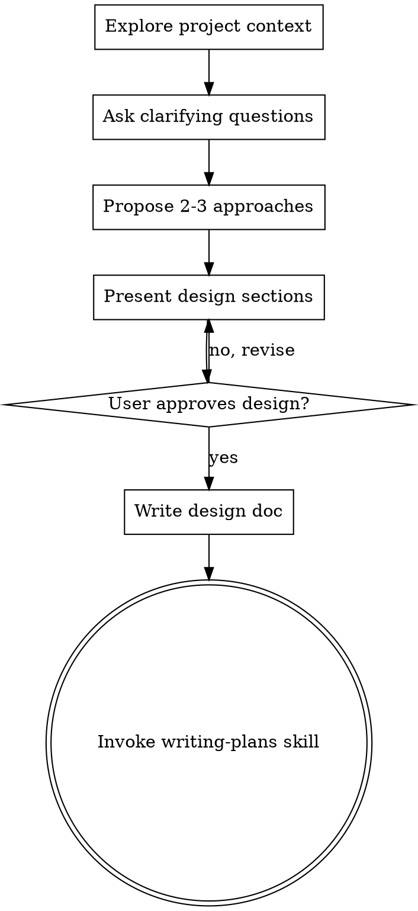

# Brainstorming Ideas Into Designs

## Overview

Help turn ideas into fully formed designs and specs through natural collaborative dialogue.

Start by understanding the current project context, then ask questions one at a time to refine the idea. Once you understand what you're building, present the design and get user approval.

<HARD-GATE>
Do NOT invoke any implementation skill, write any code, scaffold any project, or take any implementation action until you have presented a design and the user has approved it. This applies to EVERY project regardless of perceived simplicity.
</HARD-GATE>

## Anti-Pattern: "This Is Too Simple To Need A Design"

Every project goes through this process. A todo list, a single-function utility, a config change — all of them. "Simple" projects are where unexamined assumptions cause the most wasted work. The design can be short (a few sentences for truly simple projects), but you MUST present it and get approval.

## Checklist

You MUST create a task for each of these items and complete them in order:

1. **Explore project context** — check files, docs, recent commits
2. **Ask clarifying questions** — one at a time, understand purpose/constraints/success criteria
3. **Propose 2-3 approaches** — with trade-offs and your recommendation
4. **Present design** — in sections scaled to their complexity, get user approval after each section
5. **Write design doc** — save to `docs/plans/YYYY-MM-DD-<topic>-design.md` and commit
6. **Transition to implementation** — invoke writing-plans skill to create implementation plan

## Process Flow



**The terminal state is invoking writing-plans.** Do NOT invoke frontend-design, mcp-builder, or any other implementation skill. The ONLY skill you invoke after brainstorming is writing-plans.

## The Process

**Understanding the idea:**
- Check out the current project state first (files, docs, recent commits)
- Ask questions one at a time to refine the idea
- Prefer multiple choice questions when possible, but open-ended is fine too
- Only one question per message - if a topic needs more exploration, break it into multiple questions
- Focus on understanding: purpose, constraints, success criteria

**Exploring approaches:**
- Propose 2-3 different approaches with trade-offs
- Present options conversationally with your recommendation and reasoning
- Lead with your recommended option and explain why

**Presenting the design:**
- Once you believe you understand what you're building, present the design
- Scale each section to its complexity: a few sentences if straightforward, up to 200-300 words if nuanced
- Ask after each section whether it looks right so far
- Cover: architecture, components, data flow, error handling, testing
- Be ready to go back and clarify if something doesn't make sense

## After the Design

**Documentation:**
- Write the validated design to `docs/plans/YYYY-MM-DD-<topic>-design.md`
- Use elements-of-style:writing-clearly-and-concisely skill if available
- Commit the design document to git

**Implementation:**
- Invoke the writing-plans skill to create a detailed implementation plan
- Do NOT invoke any other skill. writing-plans is the next step.

## Key Principles

- **One question at a time** - Don't overwhelm with multiple questions
- **Multiple choice preferred** - Easier to answer than open-ended when possible
- **YAGNI ruthlessly** - Remove unnecessary features from all designs
- **Explore alternatives** - Always propose 2-3 approaches before settling
- **Incremental validation** - Present design, get approval before moving on
- **Be flexible** - Go back and clarify when something doesn't make sense


---

---
name: writing-plans
description: Use when you have a spec or requirements for a multi-step task, before touching code
---

# Writing Plans

## Overview

Write comprehensive implementation plans assuming the engineer has zero context for our codebase and questionable taste. Document everything they need to know: which files to touch for each task, code, testing, docs they might need to check, how to test it. Give them the whole plan as bite-sized tasks. DRY. YAGNI. TDD. Frequent commits.

Assume they are a skilled developer, but know almost nothing about our toolset or problem domain. Assume they don't know good test design very well.

**Announce at start:** "I'm using the writing-plans skill to create the implementation plan."

**Context:** This should be run in a dedicated worktree (created by brainstorming skill).

**Save plans to:** `docs/plans/YYYY-MM-DD-<feature-name>.md`

## Bite-Sized Task Granularity

**Each step is one action (2-5 minutes):**
- "Write the failing test" - step
- "Run it to make sure it fails" - step
- "Implement the minimal code to make the test pass" - step
- "Run the tests and make sure they pass" - step
- "Commit" - step

## Plan Document Header

**Every plan MUST start with this header:**

```markdown
# [Feature Name] Implementation Plan

> **For Antigravity:** REQUIRED WORKFLOW: Use `.agent/workflows/execute-plan.md` to execute this plan in single-flow mode.

**Goal:** [One sentence describing what this builds]

**Architecture:** [2-3 sentences about approach]

**Tech Stack:** [Key technologies/libraries]

---
```

## Task Structure

````markdown
### Task N: [Component Name]

**Files:**
- Create: `exact/path/to/file.py`
- Modify: `exact/path/to/existing.py:123-145`
- Test: `tests/exact/path/to/test.py`

**Step 1: Write the failing test**

```python
def test_specific_behavior():
    result = function(input)
    assert result == expected
```

**Step 2: Run test to verify it fails**

Run: `pytest tests/path/test.py::test_name -v`
Expected: FAIL with "function not defined"

**Step 3: Write minimal implementation**

```python
def function(input):
    return expected
```

**Step 4: Run test to verify it passes**

Run: `pytest tests/path/test.py::test_name -v`
Expected: PASS

**Step 5: Commit**

```bash
git add tests/path/test.py src/path/file.py
git commit -m "feat: add specific feature"
```
````

## Remember
- Exact file paths always
- Complete code in plan (not "add validation")
- Exact commands with expected output
- Reference relevant skills with @ syntax
- DRY, YAGNI, TDD, frequent commits

## Execution Handoff

After saving the plan, use a single execution path:

**"Plan complete and saved to `docs/plans/<filename>.md`.**
**Next step: run `.agent/workflows/execute-plan.md` to execute this plan task-by-task in single-flow mode."**

Execution requirements:
- **Entry workflow:** `.agent/workflows/execute-plan.md`
- **Execution skill:** `.agent/skills/executing-plans/SKILL.md`
- **Enforced execution model:** `.agent/skills/single-flow-task-execution/SKILL.md`
- **Tracking:** update `<project-root>/docs/plans/task.md` (table-only tracker)


---

---
name: executing-plans
description: Use when you have a written implementation plan and need to execute it in Antigravity single-flow mode
---

# Executing Plans

## Overview

Load plan, review critically, execute tasks in batches, report for review between batches.

**Core principle:** Batch execution with checkpoints for architect review.
**Entrypoint principle:** This is the standard execution entrypoint. Do not offer alternate execution modes.

**Announce at start:** "I'm using the executing-plans skill to implement this plan."

## The Process

### Step 1: Load and Review Plan

1. Read plan file
2. Review critically - identify any questions or concerns about the plan
3. If concerns: Raise them with your human partner before starting
4. If no concerns: follow the single-flow execution model from `.agent/skills/single-flow-task-execution/SKILL.md`
5. Update `<project-root>/docs/plans/task.md` (table-only tracker) and proceed

### Step 2: Execute Batch

**Default: First 3 tasks**

For each task:

1. Mark as in_progress
2. Follow each step exactly (plan has bite-sized steps)
3. Run verifications as specified
4. Mark as completed

### Step 3: Report

When batch complete:

- Show what was implemented
- Show verification output
- Say: "Ready for feedback."

### Step 4: Continue

Based on feedback:

- Apply changes if needed
- Execute next batch
- Repeat until complete

### Step 5: Complete Development

After all tasks complete and verified:

- Announce: "I'm using the finishing-a-development-branch skill to complete this work."
- **REQUIRED SKILL:** Use `.agent/skills/finishing-a-development-branch/SKILL.md`
- Follow that skill to verify tests, present options, execute choice

## When to Stop and Ask for Help

**STOP executing immediately when:**

- Hit a blocker mid-batch (missing dependency, test fails, instruction unclear)
- Plan has critical gaps preventing starting
- You don't understand an instruction
- Verification fails repeatedly

**Ask for clarification rather than guessing.**

## When to Revisit Earlier Steps

**Return to Review (Step 1) when:**

- Partner updates the plan based on your feedback
- Fundamental approach needs rethinking

**Don't force through blockers** - stop and ask.

## Remember

- Review plan critically first
- Follow plan steps exactly
- Don't skip verifications
- Reference skills when plan says to
- Between batches: just report and wait
- Stop when blocked, don't guess
- Never start implementation on main/master branch without explicit user consent
- Use `task_boundary` for coding tasks; use `browser_subagent` only for browser tasks

## Integration

**Required workflow skills:**

- **`.agent/skills/using-git-worktrees/SKILL.md`** - REQUIRED: Set up isolated workspace before starting
- **`.agent/skills/writing-plans/SKILL.md`** - Creates the plan this skill executes
- **`.agent/skills/single-flow-task-execution/SKILL.md`** - REQUIRED: Enforce single-flow execution with two-stage review
- **`.agent/skills/finishing-a-development-branch/SKILL.md`** - Complete development after all tasks


---

---
name: verification-before-completion
description: Use when about to claim work is complete, fixed, or passing, before committing or creating PRs - requires running verification commands and confirming output before making any success claims; evidence before assertions always
---

# Verification Before Completion

## Overview

Claiming work is complete without verification is dishonesty, not efficiency.

**Core principle:** Evidence before claims, always.

**Violating the letter of this rule is violating the spirit of this rule.**

## The Iron Law

```
NO COMPLETION CLAIMS WITHOUT FRESH VERIFICATION EVIDENCE
```

If you haven't run the verification command in this message, you cannot claim it passes.

## The Gate Function

```
BEFORE claiming any status or expressing satisfaction:

1. IDENTIFY: What command proves this claim?
2. RUN: Execute the FULL command (fresh, complete)
3. READ: Full output, check exit code, count failures
4. VERIFY: Does output confirm the claim?
   - If NO: State actual status with evidence
   - If YES: State claim WITH evidence
5. ONLY THEN: Make the claim

Skip any step = lying, not verifying
```

## Common Failures

| Claim | Requires | Not Sufficient |
|-------|----------|----------------|
| Tests pass | Test command output: 0 failures | Previous run, "should pass" |
| Linter clean | Linter output: 0 errors | Partial check, extrapolation |
| Build succeeds | Build command: exit 0 | Linter passing, logs look good |
| Bug fixed | Test original symptom: passes | Code changed, assumed fixed |
| Regression test works | Red-green cycle verified | Test passes once |
| Agent completed | VCS diff shows changes | Agent reports "success" |
| Requirements met | Line-by-line checklist | Tests passing |

## Red Flags - STOP

- Using "should", "probably", "seems to"
- Expressing satisfaction before verification ("Great!", "Perfect!", "Done!", etc.)
- About to commit/push/PR without verification
- Trusting agent success reports
- Relying on partial verification
- Thinking "just this once"
- Tired and wanting work over
- **ANY wording implying success without having run verification**

## Rationalization Prevention

| Excuse | Reality |
|--------|---------|
| "Should work now" | RUN the verification |
| "I'm confident" | Confidence ≠ evidence |
| "Just this once" | No exceptions |
| "Linter passed" | Linter ≠ compiler |
| "Agent said success" | Verify independently |
| "I'm tired" | Exhaustion ≠ excuse |
| "Partial check is enough" | Partial proves nothing |
| "Different words so rule doesn't apply" | Spirit over letter |

## Key Patterns

**Tests:**
```
✅ [Run test command] [See: 34/34 pass] "All tests pass"
❌ "Should pass now" / "Looks correct"
```

**Regression tests (TDD Red-Green):**
```
✅ Write → Run (pass) → Revert fix → Run (MUST FAIL) → Restore → Run (pass)
❌ "I've written a regression test" (without red-green verification)
```

**Build:**
```
✅ [Run build] [See: exit 0] "Build passes"
❌ "Linter passed" (linter doesn't check compilation)
```

**Requirements:**
```
✅ Re-read plan → Create checklist → Verify each → Report gaps or completion
❌ "Tests pass, phase complete"
```

**Agent delegation:**
```
✅ Agent reports success → Check VCS diff → Verify changes → Report actual state
❌ Trust agent report
```

## Why This Matters

From 24 failure memories:
- your human partner said "I don't believe you" - trust broken
- Undefined functions shipped - would crash
- Missing requirements shipped - incomplete features
- Time wasted on false completion → redirect → rework
- Violates: "Honesty is a core value. If you lie, you'll be replaced."

## When To Apply

**ALWAYS before:**
- ANY variation of success/completion claims
- ANY expression of satisfaction
- ANY positive statement about work state
- Committing, PR creation, task completion
- Moving to next task
- Delegating to agents

**Rule applies to:**
- Exact phrases
- Paraphrases and synonyms
- Implications of success
- ANY communication suggesting completion/correctness

## The Bottom Line

**No shortcuts for verification.**

Run the command. Read the output. THEN claim the result.

This is non-negotiable.

