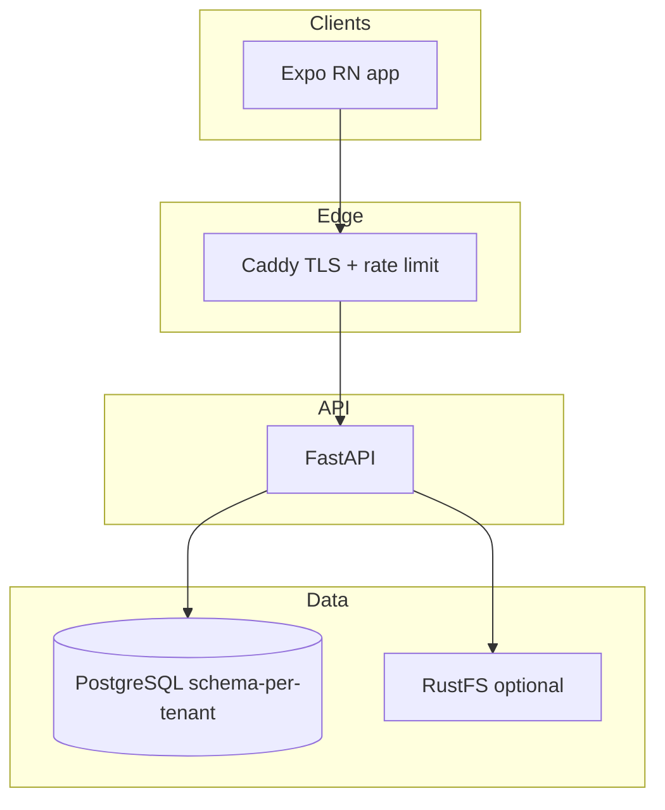
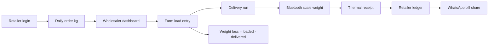

# LedgerDesk Architecture

## Architectural Changes Log
*Note: Each time the architecture changes, append the change in this section with a timestamp. NEVER overwrite the historical architecture.*

### [2026-07-21] Initial LedgerDesk Architecture Tracking

## Application Type
Single-tenant B2B application for Poultry Business Management (Wholesalers, Farms, Chicken Shops). Supports both Android Mobile (primary) and Desktop/Web (for office use).

## Stack Overview
- **Frontend (Mobile)**: React Native (Expo)
  - UI Styling: NativeWind / Tailwind CSS
  - State/Data Management: React Query, Zustand
  - Navigation: Expo Router / React Navigation
- **Frontend (Web)**: React
  - UI Styling: Tailwind CSS
  - Framework: Vite
- **Backend**: Python (FastAPI)
  - ORM: SQLAlchemy (Async)
  - Migrations: Alembic
  - Authentication: JWT (Single-tenant login)
- **Database**: PostgreSQL
  - Schema: Standard `public` schema.
- **CI/CD**: GitHub Actions
  - Workflows: Automated Android APK builds and web deployment

## Code Files & Folders Structure

```text
Layer-Brolier (Root)
├── .agents/
│   ├── .env
│   └── AGENTS.md
├── .core/
│   ├── ADMIN_PLAN.md
│   ├── AGENT_COMMANDS.md
│   ├── ARCHITECTURE.md
│   ├── CHAT_LOG.md
│   ├── DATA_MODELS.md
│   ├── IDEA.md
│   ├── RULES.md
│   ├── SESSION_HISTORY.md
│   └── TEST_CREDENTIALS.md
├── backend/          # FastAPI Python Backend
├── frontend_mobile/  # Expo React Native App
└── frontend_web/     # Vite React App (Planned)
```

### [2026-08-09 00:10:00] Pivot → Broiler Wholesale App (Duro_POS-aligned)

**Trigger:** Build against `Broiler_Wholesale_App_Proposal.md`, using `D:\POS\Duro_POS` (Brolier 360 / Duro POS) as the reference tech stack, project structure, and architecture.

**Product rename:** LedgerDesk planning docs remain above for history. Going forward this workspace targets **Broiler Wholesale Management App** (wholesaler → farm load → retailer delivery → bill → ledger → weight-loss).

## Application Type (current)

Multi-tenant B2B mobile-first app for broiler wholesalers who buy from farms and deliver to retail chicken shops daily. Primary client is Android (Bluetooth scale + thermal printer). Optional web admin later.

## Stack Overview (adopted from Duro_POS)

| Layer | Choice | Notes from Duro_POS |
|-------|--------|---------------------|
| **API** | FastAPI, SQLAlchemy 2 async, Alembic, `uv`, Python 3.11+ | JWT auth; Argon2 (`pwdlib`); structured `{ error: { code, message } }` |
| **DB** | PostgreSQL + asyncpg | Schema-per-tenant (`public` control plane + `tenant_<slug>`) |
| **App** | Expo 54, React Native 0.81, TypeScript | Zustand, React Navigation, NativeWind, Tamagui |
| **Hardware** | `react-native-ble-plx`, ESC/POS thermal (`@haroldtran/react-native-thermal-printer`) | Scale weight → delivery line; print-before-commit pattern |
| **Edge** | Caddy 2 (TLS + rate limit) | Compose-hardened services |
| **Object storage** | RustFS / S3-compatible (optional) | No blobs in Postgres |
| **Pkg managers** | `uv` (backend), `nub` (frontend) | Match Duro_POS tooling |
| **Reports** | ReportLab / fpdf2 (server PDF) | Daily / weekly / monthly + ledger |

## Target Code Layout (mirror Duro_POS, domain = wholesale broiler)

```text
MMbroliers (Root)
├── .agents/
│   └── AGENTS.md
├── .core/                    # Architecture, models, rules, session logs
├── Broiler_Wholesale_App_Proposal.md
├── backend/
│   ├── app/
│   │   ├── auth/             # JWT, password, deps
│   │   ├── cli/              # bootstrap-super-admin, etc.
│   │   ├── core/             # settings, ids (uuid7), timezone (IST)
│   │   ├── db/               # engine, session, tenant_schema_scope
│   │   ├── models/           # SQLAlchemy models
│   │   ├── schemas/          # Pydantic DTOs
│   │   ├── routers/          # auth, admin, delivery, retailer, super_admin
│   │   ├── services/         # orders, farm_load, delivery, weighing, billing, ledger, weight_loss, reports
│   │   └── main.py
│   ├── migrations/           # platform Alembic
│   │   └── tenant/           # tenant Alembic chain + TENANT_MIGRATION_HEAD
│   ├── migrate.py
│   ├── main.py
│   └── pyproject.toml
├── frontend/                 # Expo app (admin + delivery + retailer roles)
│   ├── src/
│   │   ├── api/
│   │   ├── auth/
│   │   ├── components/
│   │   ├── navigation/
│   │   ├── screens/          # admin | delivery | retailer | auth
│   │   ├── store/            # Zustand
│   │   ├── services/         # BLE scale, printer, WhatsApp share
│   │   └── types/
│   ├── printer/
│   └── package.json
├── caddy/                    # reverse proxy (prod)
├── docs/                     # ADRs, postgres, migrations runbooks
├── test/                     # backend unit/integration
└── compose.yaml
```

## Reference Architecture Analyzed (Duro_POS)



### Tenancy (carry forward from Duro_POS ADR-003)

| Schema | Contents |
|--------|----------|
| `public` | `organizations`, super-admin `users`, `user_auth_index`, `permissions`, platform audit / alembic |
| `tenant_<slug>` | Wholesaler ops: retailers, users, orders, farm loads, delivery runs, bills, payments, reports data |

- Tenant APIs: `SET search_path TO <tenant_schema>, public` via pool-safe `ContextVar`.
- Login via `user_auth_index`; optional `organization_slug` on username collision.
- Two Alembic chains: platform + tenant; new org **provisions + stamps** head (does not replay full chain).

### Domain flow (from proposal — replaces LedgerDesk party/purchase/sale core)



### Roles

| Role | Capabilities |
|------|----------------|
| Super Admin | Provision wholesaler orgs / schemas |
| Wholesaler Admin | Retailers, orders dashboard, farm load, rates, ledger, reports |
| Delivery Staff | Delivery run, BLE weigh, print, capture payment notes |
| Retailer | Place daily kg orders; view deliveries, bills, payments, outstanding |

### Contracts borrowed from Duro_POS

1. **Checkout / bill:** prefer `preview → print → commit` (commit after successful print where hardware is available).
2. **Errors:** `{ "error": { "code", "message", "details?" } }`.
3. **Lists:** cursor pagination (`limit`, `has_more`, `next_cursor_*`).
4. **Images:** object storage keys only.
5. **Timezone:** IST for business dates.
6. Frontend DTOs mirror backend in `frontend/src/types/`.

### Duro_POS modules to reuse as patterns (not copy wholesale POS cart blindly)

Reusable patterns: auth/RBAC, retailers + credit/opening balance, thermal print, BLE plumbing, weight-loss service shape, admin dashboard tabs, reports/PDF, schema provisioning.

New / reshaped for this product: **daily retailer orders**, **farm load trips**, **delivery stops with live scale**, **trip-level weight-loss (loaded vs delivered)**, **WhatsApp bill sharing**, retailer self-service portal screens.

### [2026-08-09 00:10:00] Pivot → Broiler Wholesale App (Duro_POS-aligned)

**Trigger:** Build against `Broiler_Wholesale_App_Proposal.md`, using `D:\POS\Duro_POS` (Brolier 360 / Duro POS) as the reference tech stack, project structure, and architecture.

**Product rename:** LedgerDesk planning docs remain above for history. Going forward this workspace targets **Broiler Wholesale Management App** (wholesaler → farm load → retailer delivery → bill → ledger → weight-loss).

## Application Type (current)

Multi-tenant B2B mobile-first app for broiler wholesalers who buy from farms and deliver to retail chicken shops daily. Primary client is Android (Bluetooth scale + thermal printer). Optional web admin later.

## Stack Overview (adopted from Duro_POS)

| Layer | Choice | Notes from Duro_POS |
|-------|--------|---------------------|
| **API** | FastAPI, SQLAlchemy 2 async, Alembic, `uv`, Python 3.11+ | JWT auth; Argon2 (`pwdlib`); structured `{ error: { code, message } }` |
| **DB** | PostgreSQL + asyncpg | Schema-per-tenant (`public` control plane + `tenant_<slug>`) |
| **App** | Expo 54, React Native 0.81, TypeScript | Zustand, React Navigation, NativeWind, Tamagui |
| **Hardware** | `react-native-ble-plx`, ESC/POS thermal (`@haroldtran/react-native-thermal-printer`) | Scale weight → delivery line; print-before-commit pattern |
| **Edge** | Caddy 2 (TLS + rate limit) | Compose-hardened services |
| **Object storage** | RustFS / S3-compatible (optional) | No blobs in Postgres |
| **Pkg managers** | `uv` (backend), `nub` (frontend) | Match Duro_POS tooling |
| **Reports** | ReportLab / fpdf2 (server PDF) | Daily / weekly / monthly + ledger |

## Target Code Layout (mirror Duro_POS, domain = wholesale broiler)

```text
MMbroliers (Root)
├── .agents/
│   └── AGENTS.md
├── .core/                    # Architecture, models, rules, session logs
├── Broiler_Wholesale_App_Proposal.md
├── backend/
│   ├── app/
│   │   ├── auth/             # JWT, password, deps
│   │   ├── cli/              # bootstrap-super-admin, etc.
│   │   ├── core/             # settings, ids (uuid7), timezone (IST)
│   │   ├── db/               # engine, session, tenant_schema_scope
│   │   ├── models/           # SQLAlchemy models
│   │   ├── schemas/          # Pydantic DTOs
│   │   ├── routers/          # auth, admin, delivery, retailer, super_admin
│   │   ├── services/         # orders, farm_load, delivery, weighing, billing, ledger, weight_loss, reports, whatsapp helpers
│   │   └── main.py
│   ├── migrations/           # platform Alembic
│   │   └── tenant/           # tenant Alembic chain + TENANT_MIGRATION_HEAD
│   ├── migrate.py
│   ├── main.py
│   └── pyproject.toml
├── frontend/                 # Expo app (admin + delivery + retailer roles)
│   ├── src/
│   │   ├── api/
│   │   ├── auth/
│   │   ├── components/
│   │   ├── navigation/
│   │   ├── screens/          # admin | delivery | retailer | auth
│   │   ├── store/            # Zustand
│   │   ├── services/         # BLE scale, printer, WhatsApp share
│   │   └── types/
│   ├── printer/
│   └── package.json
├── caddy/                    # reverse proxy (prod)
├── docs/                     # ADRs, postgres, migrations runbooks
├── test/                     # backend unit/integration
└── compose.yaml
```

## Reference Architecture Analyzed (Duro_POS)


### Tenancy (carry forward from Duro_POS ADR-003)

| Schema | Contents |
|--------|----------|
| `public` | `organizations`, super-admin `users`, `user_auth_index`, `permissions`, platform audit / alembic |
| `tenant_<slug>` | Wholesaler ops: retailers, users, orders, farm loads, delivery runs, bills, payments, reports data |

- Tenant APIs: `SET search_path TO <tenant_schema>, public` via pool-safe `ContextVar`.
- Login via `user_auth_index`; optional `organization_slug` on username collision.
- Two Alembic chains: platform + tenant; new org **provisions + stamps** head (does not replay full chain).

### Domain flow (from proposal — replaces LedgerDesk party/purchase/sale core)


### Roles

| Role | Capabilities |
|------|----------------|
| Super Admin | Provision wholesaler orgs / schemas |
| Wholesaler Admin | Retailers, orders dashboard, farm load, rates, ledger, reports |
| Delivery Staff | Delivery run, BLE weigh, print, capture payment notes |
| Retailer | Place daily kg orders; view deliveries, bills, payments, outstanding |

### Contracts borrowed from Duro_POS

1. **Checkout / bill:** prefer `preview → print → commit` (commit after successful print where hardware is available).
2. **Errors:** `{ "error": { "code", "message", "details?" } }`.
3. **Lists:** cursor pagination (`limit`, `has_more`, `next_cursor_*`).
4. **Images:** object storage keys only.
5. **Timezone:** IST for business dates.
6. Frontend DTOs mirror backend in `frontend/src/types/`.

### Duro_POS modules to reuse as patterns (not copy wholesale POS cart blindly)

Reusable patterns: auth/RBAC, retailers + credit/opening balance, thermal print, BLE plumbing, weight-loss service shape, admin dashboard tabs, reports/PDF, schema provisioning.

New / reshaped for this product: **daily retailer orders**, **farm load trips**, **delivery stops with live scale**, **trip-level weight-loss (loaded vs delivered)**, **WhatsApp bill sharing**, retailer self-service portal screens.

### [2026-08-09 00:55:00] Implementation landed in repo

Code now exists under `backend/` and `frontend/` as specified in the target layout. Platform database `mmbroilers`; demo tenant schema `tenant_demo`. Compose + Caddy stubs at repo root. Tenant DDL uses create-from-models + alembic_version stamp (`TENANT_MIGRATION_HEAD=0001_tenant_baseline`).

### [2026-08-09 01:00:00] IDEA_Updated MVP expand

**Trigger:** Implement updates from `Broiler_Wholesale_App_IDEA_Updated.md` vs original proposal MVP.

**Billing contract flip (IDEA §17):** `weigh ? commit (PRINT_PENDING) ? print ? PATCH print-status`. `checkout_id` unique for idempotent retries. Credit-limit enforcement when `org_settings.enforce_credit_limit` and retailer `credit_limit > 0`.

**Domain expand:** `vehicles`, `org_settings` (loss warn/alert %), retailer extras (owner/whatsapp/area/route/category/credit_limit/preferred_delivery_time), `farm_loads.vehicle_id`, `delivery_stops.delivered_bird_count`, `delivery_bills.checkout_id`.

**Ops:** `GET /admin/dashboard` daily metrics + loss OK/WARN/ALERT. Tenant migration head `0002_idea_mvp_expand`; `migrate.py` repairs all org schemas.

**Still later (IDEA phases):** expenses/returns, offline sync, GPS/routes, device management, SaaS plans, AI/forecasting.
